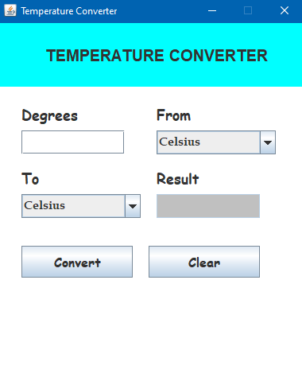

# 🌡️ Temperature Converter - Java Swing GUI Project

A simple and interactive temperature converter built using **Java Swing**. This desktop application allows users to convert temperature values between **Celsius**, **Fahrenheit**, and **Kelvin** with a clean graphical interface.

---

## 🔧 Features

- Convert between **Celsius**, **Fahrenheit**, and **Kelvin**
- Graphical User Interface using **Java Swing**
- Error handling for invalid numeric inputs
- Clear button to reset inputs and selections
- Stylish and responsive layout with intuitive controls

---

## 🖼️ Preview

> 

`` 

